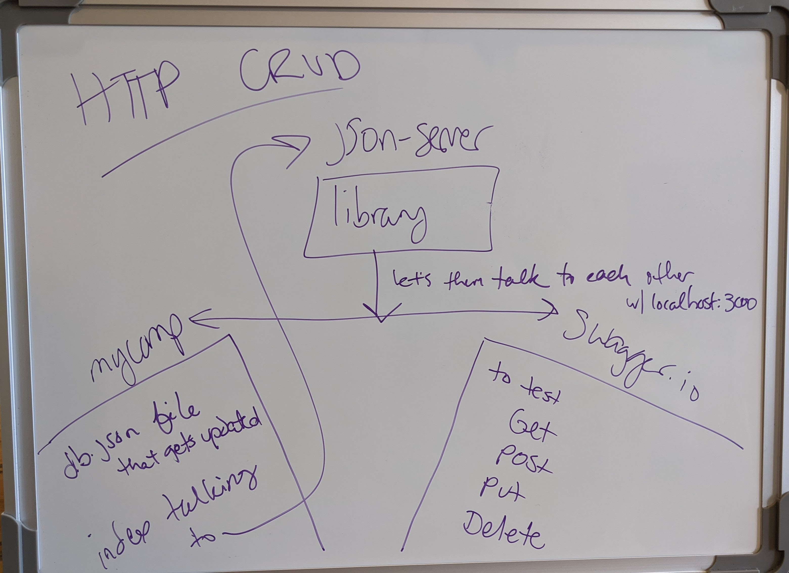
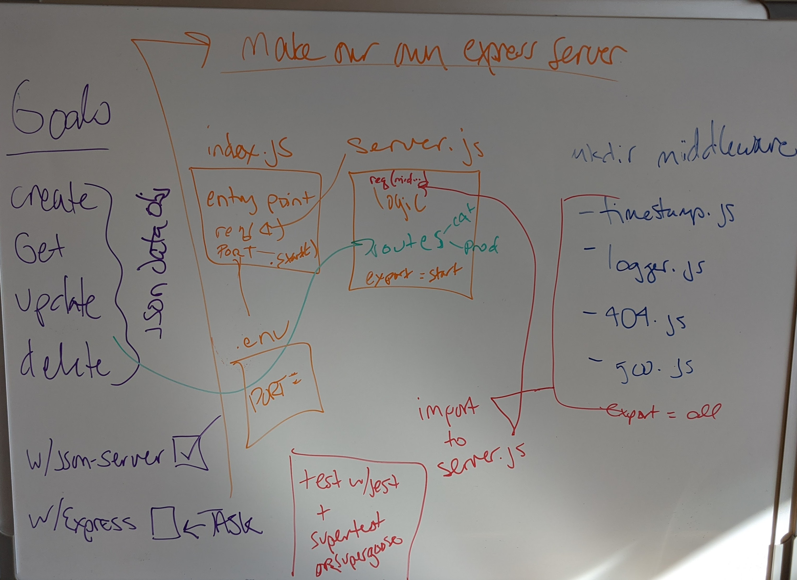

# LAB 06 - 09 | Code Fellows 401

## Project: API Server

#### Author: Tif Taylor | Date: October 2020

### Links & Resources
- [Tif's Lab06 SwaggerHub OAS](https://app.swaggerhub.com/apis/TifTaylor/TifTaylor-CF-Lab06/0.1)
- HTTP Testing Service | [Swagger](inspector.swagger.io)

### Setup
#### `.env` requirements
- PORT

#### `package.json` requirements
- `npm install`
  - [express](https://expressjs.com/)
  - [dotenv](https://www.npmjs.com/package/dotenv)

#### Running the app
- `npm start`

#### Tests
- Unit Tests: `npm test`
- `npm install`
  - [jest](https://jestjs.io/)
  - [supertest](https://www.npmjs.com/package/supertest)

### UML for Lab07 thru Lab 09
**Lab 06**

**Lab 07**

**Lab 08**

**Lab 09**
